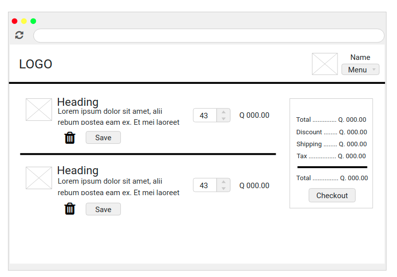
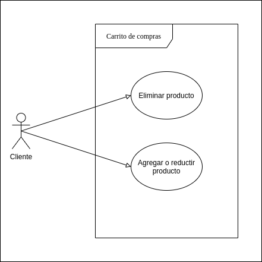
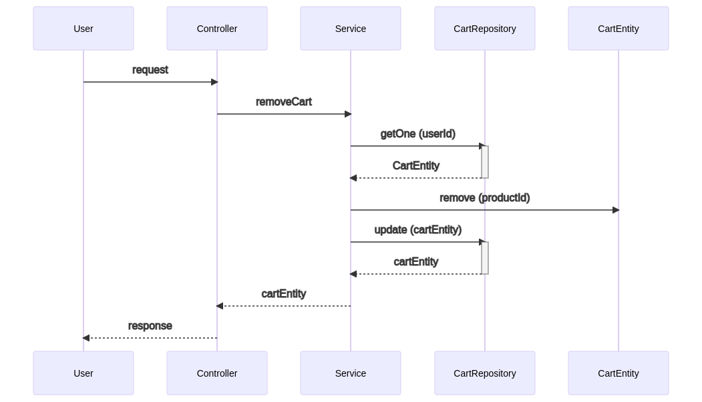
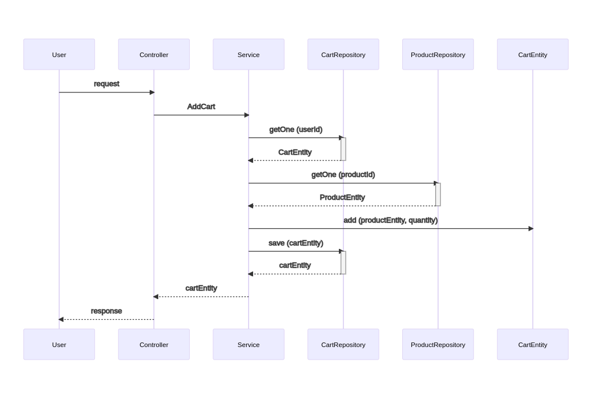
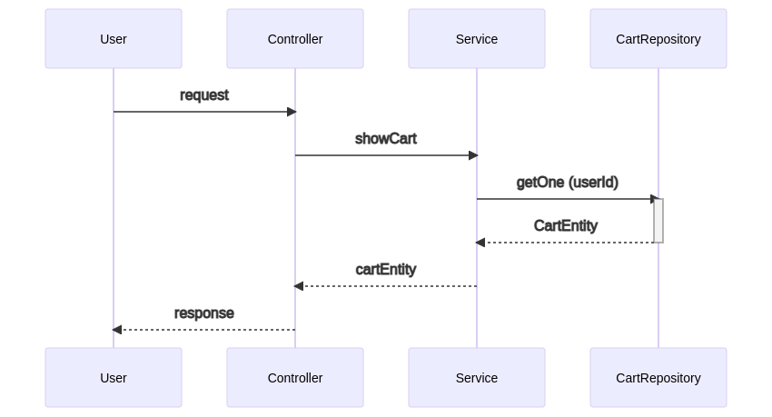

# Requerimientos

## 1.0 - Carrito de Compras

### A. Requerimiento funcional

* Los clientes pueden o no registrase para acceder a visitar el sistema Publishes and sells, sin embargo, para manejar el carrito de compras, acceder al servicio de help desk y dejar comentarios si deben estar registrados.
* Al momento de registrase se habilitara el carrito.
* Debe tomar en cuenta que despues de iniciar sesion se tienen nuevas funcionalidades, como por ejemplo se podra visualizar el estado actual del carrito,
* El nombre del usuario y su fotografia debera aparecer en todas las paginas como se observa en la parte superior derecha de la imagen de abajo.
* Cada cliente contara con un carrito de compras unico en el que se pueden agregar productos de diferentes entidades, el carrito de compras tendra los siguientes campos para su manejo:
    * El cliente asociado
    * Los productos tendran
        * cantidad
            * un producto no puede estar dos veces en el mismo carrito, para eso existe el campo cantidad
        * precio
        * total
    * total, del carrito
* El carrito de compras debe quedar guardado en la base de datos para que los clientes no pierdan los cambios afectados y realizar la compra cuando deseen.
* El carrito debe permitir las operaciones basicas, los cuales son: agregar producto, eliminar producto, comprar, guardar. Al agregar un producto debe permirit ingresar la cantidad.

B. Diagrama de casos de uso

C. Descripcion del diagrama de uso

CU-001 | Eliminar producto del carrito

* tabla de la descripcion

| | | 
| --- | --- |
|**ID**|CU-001|
|**Nombre**|Eliminar producto del carrito.|
|**Descripcion**|Permite al usuario eliminar un producto del carrito de compras, que ya no desee.|
|**Datos**|<ul><li>...</li></ul> |
|**Actores**|Usuario Cliente|
|**Pre-condiciones**|El usuario debe estar registrado, haber iniciado sesion y tener los permisos necesarios.|
|**Respuesta**|Mensaje de confirmacion de que el producto se elimino exitosamente del carrito y el listado y precios actualizados.|
|**Post-condiciones**|Ninguna.|
|**Flujo Normal**|<ol><li>El usuario selecciona la opcion 'Eliminar'.</li><li>Se muetra un cudro de dialogo para confirmar si esta seguro de eliminarlo.</li><li>El usuario confirma la eliminacion del producto.</li><li>Se muestra la siguiente informacion:<ul><li>Un mensaje de confirmacion del producto eliminado</li><li>El listado del carrito de compras sin el producto eliminado</li><li>El total a pagar actualizado</li></ul></li></ol> |
|**Flujo Alterno**|<ol><li>El producto a eliminar ya no existe del carrito.</li><li>El usuario no ha iniciado sesion.</li><li>El carrito esta vacio.</li></ol>|
|**Excepciones**|<ul><li>Mostrar un mensaje de error, indicando que el producto ya no existe en el carrito.</li><li>Redireccionando al inicio de session para autorizar la eliminacion del producto.</li> <li>Mostrar un error al usuario, indicando que el carrito esta vacio.</li></ul> |
|**Escenarios**|<ol><li>Eliminar un producto del carrito exitosamente.</li><li>Eliminacion fallida por inexistencia del producto dentro del carrito</li><li>Eliminacion fallida por no haber iniciado sesion</li><li>Eliminacion fallida por el carrito esta vacio.</li></ol> |
|**Efectos colaterales**|<ul><li>Falla en obtener detalles del carrito de compras.</li><li>Falla en la conexion a la base de datos.</li><li>Falla en la autenticacion y autorizacion del usuario.</li><li>Falla en la consulta de la base de datos.</li> </ul>|

* Diagrama de secuencia

* tabla de la descripcion

| | | 
| --- | --- |
|**ID**|CU-002|
|**Nombre**|Agregar producto al carrito.|
|**Descripcion**|Permite al usuario agregar un producto al carrito de compras.|
|**Datos**|<ul><li>...</li></ul> |
|**Actores**|Usuario Cliente|
|**Pre-condiciones**|El usuario debe estar registrado, haber iniciado sesion y tener los permisos necesarios.|
|**Respuesta**|Mensaje de confirmacion de que el producto se agrego exitosamente del carrito y el listado actualizado con el producto agregado y precios actualizados.|
|**Post-condiciones**|Ninguna.|
|**Flujo Normal**|<ol><li>El usuario selecciona la opcion 'Agregar al carrito'.</li><li>Se actualiza el icono del carrito se la siguente forma: <ul><li>Si el producto no existe incrementa el numero del carrito</li><li>Si existe el producto en el carrito no se muestran los cambios</li></ul></li><li>Se muestra un mensaje en la parte superior indicadon que el producto se agrego al carrito exitosamente.</li></ol> |
|**Flujo Alterno**|<ol><li>El producto a agregar ya no existe.</li><li>El usuario no ha iniciado sesion.</li><li>La cantidad es mayor al stock del producto</li></ol>|
|**Excepciones**|<ul><li>Mostrar un mensaje de error, indicando que el producto ya no existe.</li><li>Redireccionando al inicio de session para autorizar la agregacion del producto.</li> <li>Mostrar un error al usuario, indicando que no hay suficiente cantidad.</li></ul> |
|**Escenarios**|<ol><li>Agregar un producto del carrito exitosamente.</li><li>Agregacion fallida por inexistencia del producto</li><li>Eliminacion fallida por no haber iniciado sesion</li><li>Eliminacion fallida por cantidad insuficiente en el stock del producto.</li></ol>|
|**Efectos colaterales**|<ul><li>Falla en obtener el carrito de compras del usuario.</li><li>Falla en la conexion a la base de datos.</li><li>Falla en la autenticacion y autorizacion del usuario.</li><li>Falla en la consulta de la base de datos.</li></ul>|

* Diagrama de secuencia

* tabla de la descripcion

| | | 
| --- | --- |
|**ID**|CU-003|
|**Nombre**|Listar carrito de compras.|
|**Descripcion**|Permite al usuario ver todos los productos que contiene el carrito de compras.|
|**Datos**|<ul><li>...</li></ul> |
|**Actores**|Usuario Cliente|
|**Pre-condiciones**|El usuario debe estar registrado, haber iniciado sesion y tener los permisos necesarios.|
|**Respuesta**|Mostrar el listado actualizado de todos los producto que estan en el carrito de compras con sus precios y stock actualizados.|
|**Post-condiciones**|Ninguna.|
|**Flujo Normal**|<ol><li>El usuario selecciona el icono del carrito de compras ubicado en la parte superior derecha</li><li>Se direcciona a la pagina del carrito de compras</li><li>La pagina muestra la siguiente informacion: <ul><li>listado de todos los productos del carrito y cada elemento debe mostrar la siguiente informacion:<ul><li>Imagen del producto</li><li>Titulo</li><li>url del producto</li><li>...</li></ul></li><li>Total a pagar (incluye: shipping, dicount, tax)</li></ul></li></ol>|
|**Flujo Alterno**|<ol><li>Carrito vacio.</li><li>El usuario no ha iniciado sesion.</li></ol>|
|**Excepciones**|<ul><li>Redireccionando al inicio de session para autorizar el visualizar el carrito de compras.</li></ul>|
|**Escenarios**|<ol><li>Mostrar el carrito exitosamente.</li><li>Visualizacion fallida por no haber iniciado sesion</li></ol>|
|**Efectos colaterales**|<ul><li>Falla en obtener el carrito de compras del usuario.</li><li>Falla en la conexion a la base de datos.</li><li>Falla en la autenticacion y autorizacion del usuario.</li><li>Falla en la consulta de la base de datos.</li></ul>|

* Diagrama de secuencia

