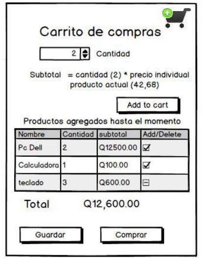

# Proyecto: Publishes and Sells

## Introducción
- En la actualidad la tecnología web y móvil ha puesto en el mundo una necesidad irreemplazable desde que hubo internet y desde que aparecieron los teléfonos inteligentes, se ha vuelto el pilar de desarrollo mundial, así como un eje donde circulan los negocios globalizados. Por esto, hay una gran necesidad de encontrar soluciones innovadoras y productivas para competir en esta rama de la computación la cual actualmente se desenvuelve a través de negocios en línea que son sitios web conectados a bases de datos, y en complemento gestionados vía web o vía aplicaciones móviles. Existen muchas tecnologías, sin embargo, algunas de las principales se pueden mencionar como Android para móviles, frameworks de javascript para aplicaciones web con HTML5 y CSS3, y bases de datos Oracle.

## Objetivos
- Implementar un modelo de bases de datos eficaz y eficiente.
- Crear una plataforma web y móvil con conexión a una base de datos relacional.
- Construir una base de datos a través del uso de archivos de scripts SQL.
- Construir sistemas totalmente funcionales a través de Android, Javascript|TypeScript y Oracle.
- Diseñar un sistema funcional y atractivo para negocios reales.

## Descripción del proyecto
- La empresa publishes and sells desea que tanto grandes como pequeños empresarios se inicien en el mundo digital de las ventas, ya que hoy en día todos los negocios que quieran permanecer y crecer deben desarrollar una presencia relevante en internet. La mayoría de las marcas importantes disponen ya de al menos una web corporativa en la que muestran las fortalezas de su marca, y muchas de ellas además se atreven a vender online. Ahora bien, ¿Por qué Publishes and sells ha tomado la decisión de motivar a los grandes y pequeños empresarios a entrar al mundo digital? porque, entre otras razones, los costos fijos de una tienda online son infinitamente inferiores a los de una tienda física, la visibilidad de un escaparate de una tienda física llega a los peatones que circulan por la calle o dentro de un centro comercial, mientras que la visibilidad de las marcas o tienda en la red es mundial. Los costos de publicidad son mucho más bajos que en los medios tradicionales.

- La empresa Publishes and sells tiene pronosticado lanzar su sistema web y móvil a finales del presente año, ya que con ello podrán empezar a generar un nuevo mercado digital. Para ello a usted como ingeniero en ciencias y sistemas se le ha contratado para analizar, diseñar y construir un sistema el cual debe estar adaptado para cumplir todos los requerimientos de la empresa Publishes and sells, y al mismo tiempo debe estar a la altura de las nuevas formas operacionales en cuanto a negocios online se trata.

- El sistema por construir se desenvolverá de la siguiente forma:

### Sitio Web
- El sitio web será una plataforma diseñada y personalizada para todos las empresas, marcas o tiendas que deseen vender sus productos, y la función que tendrá es lanzar cada producto en la web para que los clientes puedan consultar a través de filtros y detalles los diferentes productos o servicios que cada entidad ofrece. Este será un sitio web implementado con el lenguaje de programación JavaScript dependiendo de su distribución, puesto que debe ser necesario conectar a una base de datos, ya que será un sitio transaccional.
- El sitio web servirá como un escaparate para cada entidad, es decir, no solo es una tarjeta de presentación sino el lanzamiento de todas las operaciones y transacciones físicas a un mundo digital. Aunque también debe cuidarse la parte visible al cliente, llamada Frontend, puesto que es la pintura que también vende a los productos. Para lo cual se deberá utilizar tecnologías de punta como lo son HTML5, CSS3 y responsive design. Esto es muy accesible ya que se han lanzado al público frameworks, de licencias libres, de diseño y animaciones, e incluso plantillas completas que realizan el trabajo de diseñador gráfico por uno y ahorran mucho tiempo de trabajo.

### Aplicación Móvil
- Como bien se sabe la tendencia actual de tecnología está centrada a los teléfonos inteligentes ya que una gran cantidad de personas generan tráfico a través de estos, por lo que Publishes and sells ha decidido tomar en cuenta el juicio de expertos los cuales aseguran que no tener una aplicación móvil para las ventas-compras es perder una gran cantidad de clientes deseados para cada entidad. Para lo cual se utilizará Android, pues es una de las plataformas que dominan el mercado de los teléfonos inteligentes y las licencias de uso favorecen demasiado para optimizar recursos económicos.
- Los lenguajes de programación y base de datos:
    - Para el Backend NodeJS
    - Para el Frontend Angular
    - HTML5 y CSS para que el sitio sea funcional, atractivo y refleje la imagen de cada entidad.
    - Oracle en cualquier versión superior a la 11g en su versión Express para la base de datos, instalado sobre un servidor de distribución GNU/Linux ya que estudios demuestran que son los mejores sistemas operativos en cuanto a servidores.
    - Flutter para la aplicación móvil.

## Plataforma web

### Panel de Administración General (Administrador)

#### Configuración de datos
- Los datos que tendrá Publishes and sells para su portada principal son:
    - Nombre
    - Eslogan
    - Imagen de logo
    - Video de presentación3 (explicando que hace Publishes and sells)
    - Misión y Visión
    - About me

### Roles
- Básicamente el sistema cuenta con tres roles, **administrador del sitio**, **help desk** y **cliente**. El administrador del sitio será toda persona que interactúe directamente en configuraciones y desarrollo de nuevas funcionalidades del sistema, help desk es la persona encargada de dar el servicio de atención al cliente, el cliente será toda persona que quiera vender-comprar productos en el sistema.

### CRUD de Usuarios
- El sistema permitirá registrar nuevos usuarios al sistema, los clientes se registrarán desde un formulario en la web, lo usuarios administradores y help desk solo podrán ser creados por otro administrador, por lo que este tipo de registro será distinto al de clientes. 
- Los usuarios del sistema tendrán:
    - Número identificador*
    - Genero
    - Nombre
    - Fecha de nacimiento
    - Apellidos
    - Fecha de Registro*
    - Clave de acceso
    - Dirección
    - Correo
    - Crédito Disponible**
    - Teléfono
    - Ganancia obtenida**
    - Fotografía
    - Clase Cliente*
    - El cliente podrá eliminar, visualizar y actualizar su cuenta, en el momento que lo desee. Cuando un cliente se registra se envía un mensaje vía correo por parte del sistema, para hacer la validación de correo electrónico, mientras el cliente no active su cuenta por medio del link proporcionado no podrá ingresar al sistema. Ver imagen 2 e imagen 3. 
    - Cuando un administrador y help desk son registrados, se le otorgarán sus credenciales de acceso a su cuenta de correo y automáticamente tendrán su espacio en el sitio web. Un administrador podrá dar de alta, baja, congelar, visualizar y actualizar una cuenta asignada a cualquier tipo de usuario. Si en dado caso elimina, crea, congela y actualiza una cuenta deberá dar una descripción del porque esa cuenta fue gestionada con algún tipo de operación (se recomienda hacer una bitácora), la implementación del registro de las operaciones realizadas será por medio de un **STORE PROCEDURE**.
    - 4 - Mínimo debe contener 8 caracteres, al menos una letra mayúscula, una letra minúscula, números y símbolos.
    - 5 - El correo electrónico debe ser válido, ya que se tendrá mensajería real.
    - * Estos campos no deben visualizarse en el formulario, ya que automáticamente deben llenarse cuando se realice el ingreso del usuario.
    - ** Son datos exclusivos del usuario Cliente, no deben poder visualizarse y el cliente no los puede editar en ningún momento. El crédito disponible es asignado de acuerdo a la clase de cliente que se le asigne de manera Random.

### Página de Access Denied
- Se debe configurar está página para que se muestre cuando un usuario intente ingresar a una página a la cual no tiene acceso.

### Reportes y Estadísticas del Sistema
- Estos reportes y estadísticas servirán para que los administradores puedan saber que funcionalidades tienen una alta eficiencia y cuales necesitan ser mejoradas. Los siguientes reportes deberán ser visualizados dentro del sistema web, como opción para descargar a formato pdf.
    - El listado de todos los help desk y el promedio de su puntuación ordenados de mayor a menor.
    - El listado de todos los help desk de sexo masculino que hayan nacido arriba de X año.
    - El listado de todos los administradores de sexo femenino que hayan nacido debajo de Y año.
    - Los clientes que más ganancias han generado ordenandos de mayor a menor.
    - Todos los productos con el promedio de su puntuación para 5,4,3,2,1,0 estrellas.
    - Top 3 de productos más vendidos.
    - Top 3 de clientes que más productos tenga en su catálogo.
    - Listado de todos los productos indicando en que categoría se encontraban, si en dado caso tiene categorías hijas debe mostrarlas.
    - Todos los productos indicando la cantidad de comentarios asignados, publicados en Y fecha.
    - Todos los productos que tengan X cantidad disponible.
    - Top 3 de productos con peor puntuación.

- X & Y son un valor ingresado por el administrador al realizar la consulta.

### Help Desk
- El servicio ofrece respuestas y soluciones acerca de dudas del cliente, entre otras cuestiones relacionadas a la utilización del sistema, como, por ejemplo: como reiniciar mi contraseña, actualizar mis datos de mi cuenta, como subir mis productos para la venta, entre otros más.
- A través de haber ingresado al sistema, el usuario puede participar dentro de un chat con un help desk que estará disponible 24/7, para poder resolver dudas más personalizadas. El help desk deberá poder visualizar a los usuarios que tienen dudas al momento. Cada conversación cuenta con los siguientes detalles:
    - El historial de la conversación debe permanecer en el tiempo, para ello se deberá guardar tanto la información, el help desk que presto el servicio, el cliente, la hora y fecha del mensaje enviado.
    - Un usuario puede eliminar una conversación, al igual que un help desk siempre y cuando se dé por solucionada la solicitud.
    - Los usuarios pueden iniciar solamente una conversación con un help desk al mismo tiempo, pero un help desk puede tener conversación con varios usuarios.
    - En cada conversación se debe indicar el estado de cada cliente, está conectado actualmente o no lo está. Quiere decir que, si actualmente el help desk está en una conversación, pero si el cliente abandona, ya no se podrá enviar mensajes ya que el estado del usuario es offline.
    - Como se sabe que hay más de un help desk disponible, se deberá distribuir a los clientes con el help desk menos cargado. Implementar un algoritmo, para que al momento que un cliente desee usar el servicio help desk, se le asigne el que tenga menos usuarios al momento. Por ejemplo, hay 3 help desk, el primero con 4 clientes, el segundo con 2 clientes y el tercero con 5 clientes, el nuevo cliente que entre se le asignara al help desk no.2 ya que es el que menos carga tiene.
    - Cuando el cliente de por solucionado su duda, automáticamente saldrá un mensaje el cual indica que le dé una puntuación al help desk que presto el servicio. La puntuación va del 1 al 10.
    - Como recomendación el chat puede ser implementado mediante web-sockets.

### Interfaz para Clientes

#### Registro e ingreso
- Los clientes pueden o no registrarse para acceder a visitar el sistema Publishes and sells, sin embargo, para manejar carrito de compras, acceder al servicio de help desk y dejar comentarios si deben estar registrados. Para tal razón se debe implementar el registro y acceso a clientes. Para que un cliente se registre se necesita conocer sus datos antes mencionados. El usuario accederá al sistema por medio de su correo electrónico y su clave será cualquiera que el cliente ingrese.

- En la funcionalidad de restablecer contraseña, se enviará un mensaje vía correo con un link que lleva a el login y la contraseña provisional, la cual será un código generado por el sistema, dicho código debe cumplir con los mismos requisitos ya mencionados para una contraseña valida.
- En la parte de implementación se deberá hacer un update a la contraseña actual por medio de un STORE PROCEDURE que recibirá de parámetro la contraseña provisional (código generado), antes de hacer el update deberá realizar un SAVEPOINT ya que, si el link se vence ya que tiene una duración de 2 minutos, se debe hacer un ROLLBACK al punto donde la contraseña no ha sido actualizada.
- Al momento de regresar al login, el usuario ingresara su correo electrónico y el código que fue proporcionado vía correo. Ya que el usuario ha podido ingresar al sistema, el podrá actualizar sus datos en la sección correspondiente a su cuenta.

#### Pagina Inicial de Usuario
- En la página inicial del usuario se podrá visualizar una lista de categorías (se debe mostrar en forma de árbol ya que una categoría puede tener otras categorías hijas) en las cuales, al hacer selección a alguna, se desplegarán los productos que cumplan con dicha categoría, las búsquedas se harán por las categorías hijas, si en dado caso una categoría padre no cuenta con categorías hijas, se realizara la búsqueda por la categoría padre, esto con el objetivo de poder encontrar los productos más rápido. Mostrar para cada producto su imagen, precio, autor o dueño del producto, descripción y cantidad disponible. Al momento de registrarse se habilitará el carrito, y al pulsar dicho botón nos enviará hacia la página individual del producto (explicada más adelante).
- La página inicial cuenta con un motor de búsqueda el cual está conformado por el campo search y el combobox el cual contiene las categorías padres en la cual se desea buscar dicho producto. El algoritmo de relación queda a discreción del estudiante, pero será por el uso de la palabra reservada LIKE de SQL según el nombre y categoría del producto. Los productos se podrán ordenar por (Order by) medio de los siguientes valores:
    - Fecha publicación tanto asc/desc
    - Puntuaciones tanto asc/desc
    - Precio tanto asc/desc

- Debe tomar en cuenta que al iniciar sesión se tienen nuevas funcionalidades, como por ejemplo se podrá visualizar el estado actual del carrito, comprar y vender productos, ingresar al servicio al cliente, entre otras.
- El nombre del usuario y su fotografía deberá aparecer en todas las páginas como se observa en la parte superior derecha de la imagen de abajo y al momento de pulsar el nombre nos enviará a la página de configuración de datos para que el usuario pueda actualizar sus datos y con opción a eliminar cuenta.

#### Configuración de Datos
- El usuario puede configurar los datos generales de su cuenta los cuales serán:
    - Correo electrónico (se debe validar al igual que cuando se crea la cuenta por primera vez).
    - Nombre
    - Apellidos
    - Dirección
    - Teléfono
    - Clave de acceso

#### Catálogo de Productos
- Una cliente debe tener una galería de productos que ofrece, la cual contiene los siguientes datos para cada uno de los productos:
    - Código del producto
    - Imagen
    - Descripción
    - Categoría, esta es una categoría que puede tener otras categorías (se recomienda hacer una entidad recursiva “categoría” para poder manejar la jerarquía entre categorías). Por ejemplo: un producto puede tener una categoría de ropa, luego esta categoría ropa puede clasificar sus productos en categorías como damas, caballeros, niños, ofertas, recientes, etc. La categoría tiene:
        - El nombre
        - Una descripción
    - Precio del producto.
    - Fecha de publicación.
    - Cantidad disponible. 6
    - Color (debe tomar en cuenta que un producto puede tener más de un color).
- Las operaciones que se pueden hacer son:
• Crear, listar, modificar y eliminar productos de la galería
•
Crear, listar, eliminar y modificar categorías

#### Carga Masiva
- El cliente puede preparar un archivo separado por comas CSV para la carga masiva de productos a su galería. El archivo debe ser subido desde la web y almacenado en el servidor; los datos deben ser cargados por medio de la llamada a un STORE PROCEDURE en las vistas.
- El formato es:
    - `Código, url-imagen, descripción, Categoría-Categoría hija, precio, cantidad, color1-color2`
    - `Código, url-imagen, descripción, Categoría-Categoría hija, precio, cantidad, color1-color2`

Ejemplo:

- La fecha de publicación se asigna automáticamente. Las categorías hijas pueden que no vengan en
el archivo de entrada y solo venga la categoría padre. Si en dado caso una categoría no existe se
deberá crear, si en dado caso es una categoría hija debe validarse que existe la categoría padre.

#### Página de producto individual
- Esta página tiene como objetivo mostrar el producto al mayor detalle posible, como se observa en la imagen prod ind ya se toma en cuenta el carrito y se muestra el estado actual del mismo. Las operaciones del carrito se explicarán más adelante. La página del producto debe mostrar como mínimo el nombre del producto, dueño del producto, puntuación del producto (es el promedio de todas las puntuaciones que han dado los clientes a dicho producto), descripción del producto, imagen, cantidad disponible, precio, colores. Estará disponible un link para poder ir a la página de comentarios y puntuaciones del producto actual.

#### Comentarios y puntuación de productos
- Se manejarán comentarios simples por cada producto, es decir, un cliente registrado puede dejar su comentario para el producto que compro o desea comprar, estos comentarios se mostrarán en una página nueva en la cual llegaremos atreves de la página individual del producto. Estos comentarios tendrán el nombre del autor, la fecha, titulo, ponderación otorgada y el cuerpo del comentario.
- Los dueños de productos podrán eliminar comentarios no deseados en su sección, o también responder a comentarios. Esta página contendrá un detalle de las estadísticas de las puntuaciones otorgadas como se observa en la imagen.

#### Carrito de Compras
- Cada cliente contará con un carrito de compras único en el que se pueden agregar productos de diferentes entidades, el carrito de compras tendrá los siguientes campos para su manejo:
    - El cliente asociado
    - Los productos tendrán:
        - Cantidad
            - Un producto no puede estar dos veces en el mismo carrito, para eso existe el campo cantidad
        - Precio
        - Total
        - Total, del carrito
- El carrito de compras debe quedar guardado en la base de datos para que los clientes no pierdan los cambios efectuados y realizar la compra cuando deseen. Asimismo, cuando el cliente finaliza la compra, deben guardarse todos los detalles como realizar las facturas correspondientes, la fecha, el cliente, etc.
- El carrito debe permitir las operaciones básicas, los cuales son: agregar producto, eliminar producto, comprar, guardar. Al agregar un producto debe permitir ingresar la cantidad.

- Al comprar un carrito se realiza la factura y se envían todos los datos de los productos adquiridos tanto al cliente respectivo y al dueño del producto vía correo. El cobro del mismo se devenga de un crédito que el usuario tiene dependiendo que clase de cliente sea:

|TIPO|CREDITO| 
| --- | --- |
|DIAMANTE|50,000|
|PLATINO|25,000|
|ORO|10,000|
|PLATA|5,000|
|BRONCE|1,000|

- Este crédito lo paga el cliente mensualmente. Por lo que la entrega de productos llega a su domicilio. Si en dado caso alguien supera su crédito ya no podrá utilizar el carrito, se deshabilitará.
- La ganancia de cada cliente se calculará a través de las ventas por carrito y serán acreditados al usuario en su campo ganancia.
- El asunto y cuerpo del correo deben contener:

## Plataforma Móvil
- Se verificará que la página se visualice bien desde un dispositivo Android utilizando responsive design. Dado que los dispositivos móviles están tomando auge, es necesario ofrecer una vía de interacción a través de esta tecnología.

### Login
- La aplicación tendrá una pantalla para que un usuario previamente registrado ingrese y realice las operaciones requeridas. La aplicación detectará si las credenciales pertenecen a un cliente, help desk o cliente, para ello se debe mostrar automáticamente las pantallas correspondientes.
- Para la parte del cliente la aplicación debe permitir usuarios anónimos (no registrados), pero para dejar comentario, servicio al cliente, carrito, el cliente debe entrar con sus credenciales.

### Funcionamiento
- La aplicación será diseñada para obtener el tráfico de clientes los cuales pueden navegar por las funcionalidades de la misma manera que en la web.

#### Los Clientes
- Los puntos del sitio web para clientes que se implementarán en la aplicación móvil son:
    - Registro e ingreso.
    - Ventana principal del sistema
        - Portada, logo, visión, misión, menú de categorías, etc.
    - Ventana inicial del usuario.
    - Catálogo de productos.
    - Carrito de compras.
    - Ventana de producto individual.
    - Carga de productos individuales.

#### Los administradores
 Los puntos del sitio web para los administradores que se implementarán en la aplicación móvil
son:
    - CRUD de usuarios.
    - Reportes

#### Los Help Desk
- Los puntos del sitio web para los Help desk que se implementarán en la aplicación móvil son:
    - Servicio que ofrece respuestas y soluciones acerca de dudas del cliente, al igual que en la web, la implementación queda a discreción del estudiante.

### Consideraciones
- Se tomará muy en cuenta la amigabilidad, robustez y la adecuada presentación de datos.
- Se deben mostrar los datos amigables al usuario para ello deben utilizarse objetos como listas desplegables, tablas, botones, etc.
- Los datos se deben mostrar adecuadamente, por ejemplo: No mostrar ID sino sus datos que lo complementan, de lo contrario esa parte no será tomada en cuenta. 
- En la navegación del usuario, la aplicación debe ser amigable y bien estructurado. Las imágenes deben cargarse al servidor adecuadamente, así como tener una interfaz de carga, por ejemplo: un usuario debe tener una interfaz para selección de archivos y no tener una caja de texto en el que tenga que teclear la ruta.

## Requisitos Mínimos

- Registro de clientes
- Confirmación por correo
- Recuperación de Contraseña
- Bitácora de cambios
- Funcionalidad completa de los HELP DESK
- Reportes de Administrador (Con datos correctos)
- Página de productos individual
- Almacenamiento de imágenes en servidor
- Aplicación de Android **COMPLETA**

## Especificaciones
- El sistema operativo a utilizar es cualquier distribución de GNU/Linux (Instalación física, solo se calificará el proyecto sobre una distribución de GNU/Linux).
- El proyecto se realizará de forma INDIVIDUAL.
- Toda la multimedia deberá ser guardada en el servidor de su proyecto.
- Si no se realizan los reportes no se podrá calificar pues no se podrá validar que las transacciones se han realizado.
- Debe tenerse la parte de Android Completa y funcional.
- El proyecto se entrega en la fecha indicada, se tomará en cuenta que la impuntualidad en la entrega anulará su proyecto y no tendrá derecho a calificación.
- Se verificarán copias de código, cualquier copia del proyecto será sancionada CON LA PÉRDIDA AUTOMÁTICA DEL LABORATORIO y la sanción correspondiente por parte de la Escuela de Sistemas.
- No se calificarán reportes solo en DBMS, debe mostrarse en la página o descargarlos en pdf.
- No se permite el uso de cualquier otro framework que no esté descrito en el enunciado.
- Se calificará de los archivos que entreguen en la fecha estipulada, no se permitirá modificar código, deben revisar bien lo que envían, para evitar problemas en su calificación.
- Mostrar un dato incorrecto en sus reportes anulara la validez de ellos.